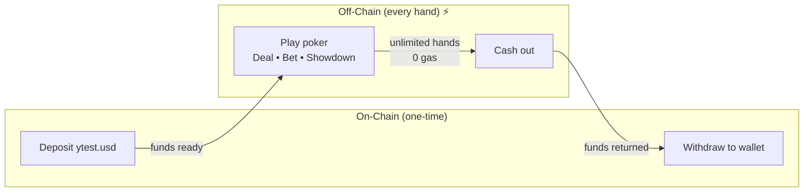
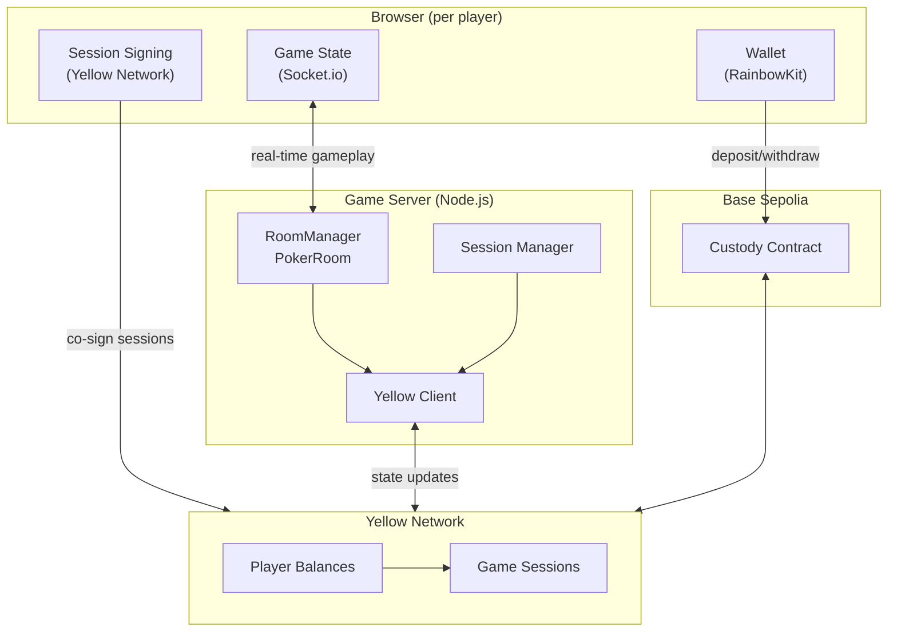
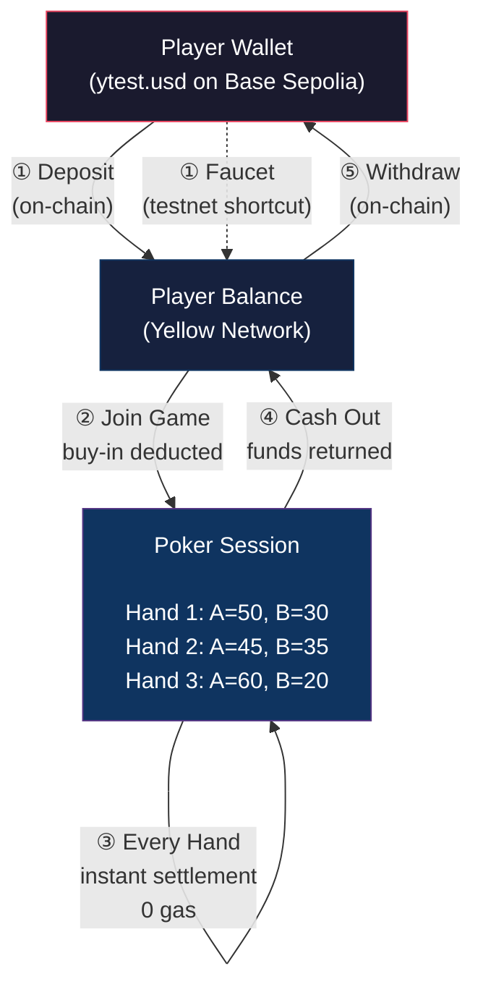
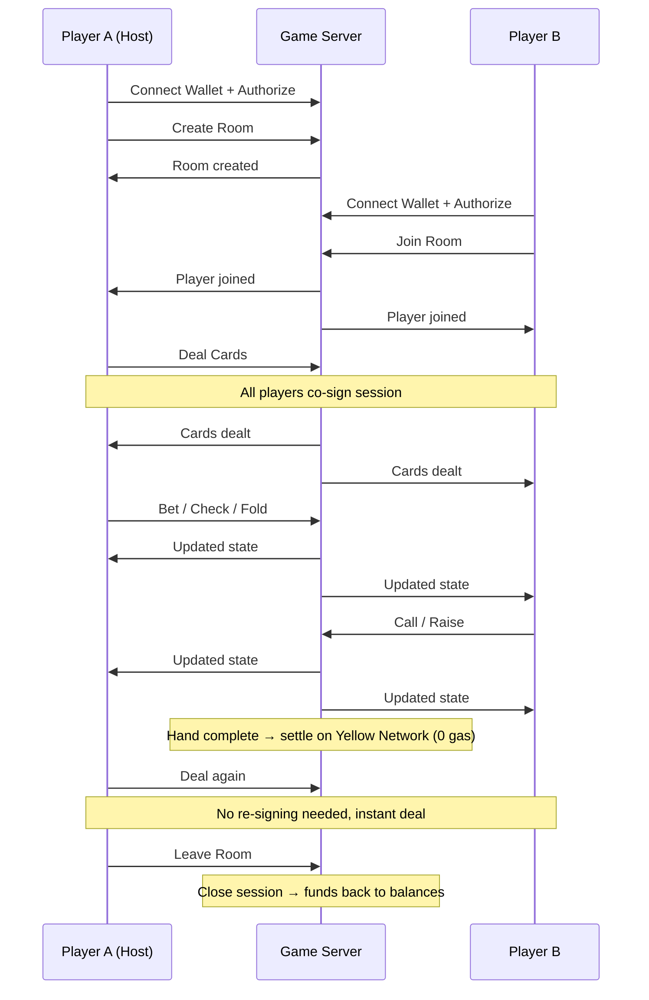

# PlayFrens

**Play poker with your frens. On-chain security, off-chain speed.**

PlayFrens is a multiplayer poker platform where friends find each other via ENS names, deposit tokens, and play unlimited hands with zero gas fees and instant settlement — powered by [Yellow Network](https://yellow.org) state channels and [ENS](https://ens.domains) identity on Base Sepolia.

No custom smart contracts. No gas per hand. Just poker.

---

## How It Works



1. **Deposit once** — send ytest.usd to the Custody contract (or use the testnet faucet)
2. **Play unlimited hands** — all gameplay happens off-chain via Yellow Network, zero gas
3. **Settle every hand** — chip allocations update instantly after each hand
4. **Withdraw anytime** — pull your funds back to your wallet whenever you want

---

## Architecture



---

## Fund Flow



---

## User Flow



---

## Features

- **Zero gas poker** — Unlimited hands after a single deposit
- **Instant settlement** — Pot distribution in milliseconds, not block times
- **ENS identity** — Find friends by `.eth` name, see avatars at the table
- **Real-time multiplayer** — Up to 4 players per table via Socket.io
- **Configurable tables** — Custom buy-in, blinds, and chip denominations
- **Deposit & withdraw** — Faucet (testnet), on-chain deposit, withdraw anytime
- **On-chain security** — Funds always recoverable via Custody contract
- **Per-hand settlement** — Chip allocations update after every hand

---

## Quick Start

### Prerequisites

- Node.js >= 18
- pnpm >= 9
- A wallet with Base Sepolia ETH (for gas on deposit/withdraw)

### Setup

```bash
git clone <repo-url>
cd PlayFrens
pnpm install
```

Copy and configure environment:

```bash
cp .env.example apps/server/.env
cp .env.example apps/web/.env
```

You'll need:
- **Alchemy API key** — free at [alchemy.com](https://alchemy.com)
- **WalletConnect Project ID** — free at [cloud.walletconnect.com](https://cloud.walletconnect.com)
- **Server wallet private key** — generate a new wallet, fund with Base Sepolia ETH

### Run

```bash
pnpm dev
```

This starts:
- **Web app** at `http://localhost:5173`
- **Game server** at `http://localhost:3001`

### Build

```bash
pnpm build
pnpm typecheck
pnpm biome:check
```

---

## How to Play

1. Open the app in two browser tabs with different wallets
2. **Tab 1**: Connect wallet → Authorize → Create a table → copy the room code
3. **Tab 2**: Connect wallet → Authorize → Join with the room code
4. Both players can request test tokens via the **Faucet** button
5. Hit **Deal Cards** — both browsers co-sign the session, then cards are dealt
6. Play through — fold, check, call, bet, raise
7. After each hand, chip allocations settle instantly (0 gas!)

---

## Tech Stack

| Layer | Technology |
|-------|-----------|
| Monorepo | pnpm workspaces + Turborepo |
| Frontend | React 19 + Vite + TypeScript |
| Styling | Tailwind CSS v4 |
| Animation | Motion (framer-motion) |
| Wallet | RainbowKit v2 + wagmi v2 + viem |
| Real-time | Socket.io |
| Poker Engine | poker-ts |
| State Channels | [Yellow Network](https://yellow.org) / @erc7824/nitrolite SDK |
| Chain | Base Sepolia (84532) |
| Identity | [ENS](https://ens.domains) (mainnet resolution) |

---

## Project Structure

```
PlayFrens/
├── apps/
│   ├── web/                    # React + Vite frontend
│   │   └── src/
│   │       ├── App.tsx                     # Main app with state-driven routing
│   │       ├── components/
│   │       │   ├── layout/                 # Header, nav, wallet connect
│   │       │   ├── lobby/                  # Room creation, ENS search, deposit/withdraw
│   │       │   └── games/poker/            # Table, seats, cards, action bar
│   │       ├── hooks/                      # useSocket, useGameState, useYellow, useCustody
│   │       ├── lib/                        # wagmi config, socket client, Yellow RPC
│   │       └── providers/                  # wagmi + RainbowKit + QueryClient
│   │
│   └── server/                 # Node.js game server
│       └── src/
│           ├── index.ts                    # Express + Socket.io bootstrap
│           ├── games/
│           │   ├── GameRoom.ts             # Abstract base class for any game
│           │   └── poker/PokerRoom.ts      # Poker implementation (wraps poker-ts)
│           ├── rooms/RoomManager.ts        # Room lifecycle management
│           ├── socket/                     # Event handlers + auth middleware
│           └── yellow/                     # Yellow Network client + session management
│
└── packages/
    └── shared/                 # Shared types, events, constants
```

---

## Smart Contracts

All contracts are [Yellow Network](https://yellow.org)'s deployed contracts on Base Sepolia — no custom contracts needed.

| Contract | Address |
|----------|---------|
| Custody | `0x019B65A265EB3363822f2752141b3dF16131b262` |
| Adjudicator | `0x7c7ccbc98469190849BCC6c926307794fDfB11F2` |
| Token (ytest.usd) | `0xDB9F293e3898c9E5536A3be1b0C56c89d2b32DEb` |

---

## Environment Variables

### Server (`apps/server/.env`)

| Variable | Description |
|----------|-------------|
| `PRIVATE_KEY` | Server wallet private key |
| `SESSION_KEY_PRIVATE_KEY` | Optional session key (auto-generated if omitted) |
| `BASE_SEPOLIA_RPC_URL` | Base Sepolia RPC endpoint |
| `CLEARNODE_WS_URL` | Yellow Network WebSocket URL |
| `CLEARNODE_APPLICATION` | Application name (default: `PlayFrens`) |
| `PORT` | Server port (default: `3001`) |

### Client (`apps/web/.env`)

| Variable | Description |
|----------|-------------|
| `VITE_WALLETCONNECT_PROJECT_ID` | WalletConnect v2 project ID |
| `VITE_SERVER_URL` | Game server URL |
| `VITE_CLEARNODE_WS_URL` | Yellow Network WebSocket URL |
| `VITE_BASE_SEPOLIA_RPC_URL` | Base Sepolia RPC endpoint |
| `VITE_CLEARNODE_APPLICATION` | Application name (must match server) |

---

## Adding New Games

The architecture is game-agnostic. To add a new game:

1. Create `apps/server/src/games/<name>/<Name>Room.ts` extending `GameRoom`
2. Create `apps/web/src/components/games/<name>/` with UI components
3. Add the game type to `GameType` in `packages/shared/src/types/game.ts`
4. Register in `RoomManager.createRoom()` switch statement

Session management and per-hand settlement work generically — any game that tracks chip counts can use the same fund flow.

---

## License

MIT
